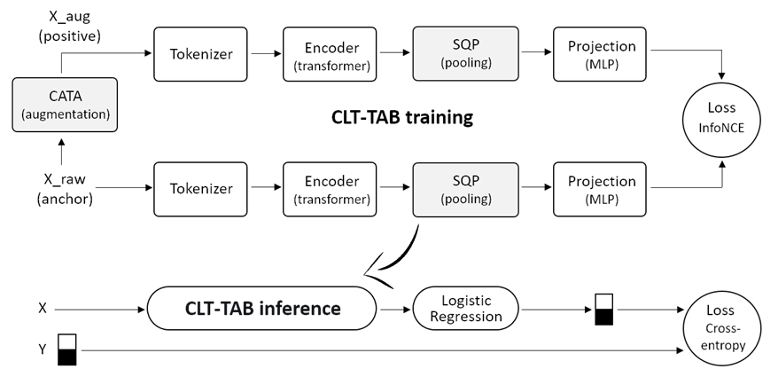

# **CLT-TAB: Contrastive Learning Transformer with Continuous Adaptive Tabular Augmentation and Stochastic Query Pooling for Tabular Data**

---

## **1. Abstract**

In this work, we present CLT-TAB — a contrastive learning transformer model for tabular data based on three key innovations: Continuous Adaptive Tabular Augmentation (CATA), masking values with a learnable neutral token at the raw data level, and Stochastic Query Pooling (SQP) that creates an ensemble effect.

Experiments on seven tabular benchmarks confirm the effectiveness of the proposed approach under limited labeled data conditions. CLT-TAB consistently outperforms SCARF and FT-Transformer on all datasets. Compared to CatBoost, the method demonstrates statistically significant superiority on four datasets, comparable results on two, and is inferior only on one dataset where PCA-transformed features and extreme imbalance limit the effectiveness of contrastive learning.

In addition to quality, CLT-TAB provides built-in interpretability through first-layer attention scores, which is critical for applications in regulated domains (finance, healthcare).

---

## **2. CLT-TAB Architecture**

CLT-TAB follows the unsupervised contrastive learning paradigm. For each object, two representations are created: anchor and positive (augmented). Both pass through a shared transformer encoder, are aggregated into a fixed-size vector via a pooling mechanism, projected through an MLP head, and optimized using the InfoNCE loss function.

### **2.1. Continuous Adaptive Tabular Augmentation (CATA)**

Unlike AGATa's binary selection, which uses attention from the last layer and a hard threshold, CATA uses attention scores from the first layer of the transformer and a smooth probabilistic masking scale, where the masking probability of each feature is proportional to its importance. This provides more fine-grained augmentation control and preserves interpretability: attention scores directly indicate each feature's contribution to the object representation.

### **2.2. Augmentation with Neutral Token**

Unlike random value substitution (SCARF) and embedding-level masking with a fixed token (MTR), we apply a learnable neutral token at the raw data level. For numerical features, this is a learnable vector; for categorical features, it is a special [UNK] index. This approach preserves the semantic integrity of the data, does not introduce false correlations, and is not tied to a specific encoder architecture.

### **2.3. Stochastic Query Pooling (SQP)**

SQP is an aggregation mechanism that uses a learnable query vector with cross-attention and stochastic regularization. SQP generalizes AdaPool: with zero dropout on the query, the method reduces to deterministic AdaPool, while with dropout enabled, it creates an ensemble effect. Unlike VQT, SQP operates at the level of final encoder representations without requiring architectural modifications, making it applicable to any transformer encoder.

**Ablation analysis findings:** CATA is the key component providing stable quality improvement, while SQP requires tuning for specific tasks.

---

## **3. CLT-TAB Training Algorithm**

**Algorithm 1: CLT-TAB Training**  
**Input:** X — unlabeled data, E — number of epochs, CR — base masking probability, α — importance influence factor  
**Output:** Trained CLT-TAB model  

1: Initialize CLT-TAB model  
2: for epoch = 1 to E do  
3:   for batch X_b in DataLoader do  
4:     Tokenize original data: T = Tokenizer(X_b)  
5:     Compute importance through first encoder layer: H, first_attn = Encoder(T, return_first_attn=True)  
6:     A = mean_over_heads(first_attn)  
7:     importance(i) = Σⱼ A_{i,j}  
8:     Apply CATA to raw data:  
9:     for each feature i do  
10:      P_mask(i) = clamp(CR × (1 - α × importance(i)), 0.05, 0.95)  
11:    end for  
12:    X_aug = replace_masked_with_neutral(X_b, P_mask)  
13:    Compute embeddings for augmented data: T_aug = Tokenizer(X_aug)  
14:    H_aug = Encoder(T_aug)  
15:    Aggregate via SQP and project: z = Projection(SQP(H))  
16:    z_aug = Projection(SQP(H_aug))  
17:    Compute InfoNCE Loss: loss = InfoNCE(z, z_aug)  
18:    Update model weights: optimizer.zero_grad(); loss.backward(); optimizer.step()  
19:  end for  
20: end for  
21: return Trained model  

---

## **4. Experiments**

### **4.1. Datasets**

We conduct experiments on 7 tabular benchmarks covering various feature types, imbalance levels, sample sizes, and data domains.

| Dataset | Domain | Size | Features | Feature Types | Balance |
|---------|-------|--------|----------|---------------|--------|
| BAF | Finance / Banking | 1,000,000 | 30 | Mixed | 89.7 : 1 |
| Credit Card Fraud | Finance / Payments | 283,726 | 30 | Numerical (PCA) | 577.8 : 1 |
| Road-safety | Transport / Safety | 111,419 | 31 | Mixed | 1.0 : 1 |
| NIDS | Cybersecurity | 72,000 | 66 | Mixed | 1.1 : 1 |
| Epsilon-30 | Synthetic | 50,000 | 30 | Numerical | 1.0 : 1 |
| Adult | Sociodemographic | 48,785 | 14 | Mixed | 3.2 : 1 |
| UCI Credit Card | Finance / Credit Risk | 29,944 | 23 | Mixed | 3.5 : 1 |

The `Datasets/` folder contains Jupyter Notebooks for loading the specified datasets.

### **4.2. CLT-TAB Training**

To train CLT-TAB, execute the algorithm presented in Section 3. The `Examples/` folder contains a Jupyter Notebook with a model training example.

### **4.3. Comparison with Other Models**

The `Experiments/` folder provides comments on the experimental logic and model configurations used in the experiments.

Experimental results are available in the `Results/` folder.
